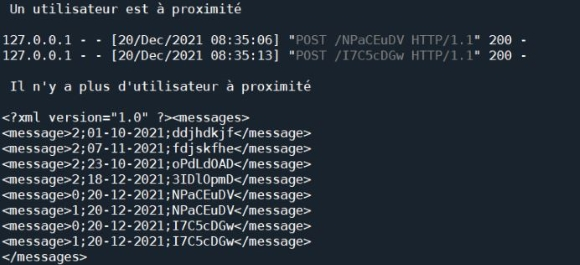
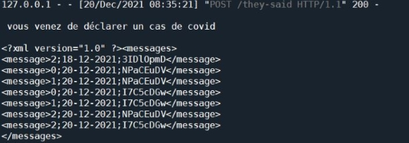
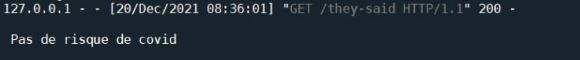

# Anticovid

## What is it?
This is my first python project, a simple program implementing swiss university EPFL's [Decentralized Privacy-Preserving Proximity Tracing](https://github.com/DP-3T/documents/blob/master/public_engagement/cartoon/en/shortened_onepage.png) strategy for covid (DP^3T) :

## Introduction
This prototype uses flask (`pip install flask`), it's designed to work with three different computers.
- One playing as the hospital
- One playing as a person's phone
- The last one playing as another phone

Each of them has access to their own catalogue. Each phone knows the IP address of the other one and of the 
hospital.

There are 3 different types of messages :
- 0: is a message sent by our phone
- 1: is a message received from the other phone
- 2: is a message received from the hospital

They are stored with the following standard: `type;date;content`. Fpr example : “*0;20-12-2021;aOLvjTPH*” is an “*I said*” message sent on December 20th.

## Try it on localhost

### 0 - Launching
Provided code is alreaydy configured to work with a single computer, just run `app.py`.

The app's test is controlled through keyboard (`pip install pynput`)
- ALT : toggle proximity between phones
- CONTROL : declare a covid case
- SHIFT : check for covid risk
- CAPS LOCK : print catalogue to console
- ESCAPE : quit the app

### 1 - Check the initial catalogue
Press **CAPS LOCK** to print the current catalogue to the console, it should match `msgxml.xml`.

### 2 - Let phones exchange messages
Press **ALT** to toggle proximity settings. phones start to exchange messages every 5s. After a few messages, you can turn proximity back off and check the catalogue's new state with **CAPS LOCK**.

_Note: see how the catalogue is shared between phones and hospital when testing on localhost._

### 3 - Declare a covid case
Press **CTRL** to declare a covid case, all your '_I said_' messages will be sent to the hospital. The hospital stores them in its catalog.

_Note: on the example above, the hospital's catalogues has been purged (outdated message where deleted), in the repository version it's puged only when a phone request the catalogue._

### 4 - covid risk?
You can now press **SHIFT** to find out. The phone will resquest all messages from the hospital and compare with his '_I read_' messages.

The result will depend on how many messages where exchanged when you turned proximity on. On the example below there are only 2 matches which is not enough : 10 messages are expected for a covid risk. You can turn proximity back on to check it out.

## Self-assessment
The code is a bit clumsy sometimes considering I was beginning with python and client-server applications. Some parts should be refactored to make it "clean" code.
